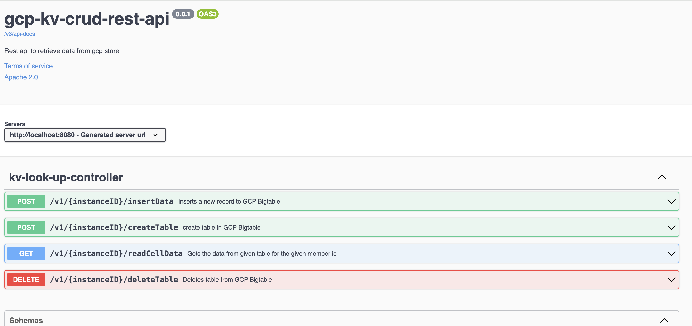

# GCP KV CRUD API

<!-- TABLE OF CONTENTS -->

  
Table of Contents

  <ol>
    <li><a href="#about-the-project">About the project</a></li>
    <li><a href="#built-with">Built with</a></li>
    <li><a href="#build-and-run-it-on-your-local">Build and run it on your local</a></li>
    <li><a href="#API-Usage">Api usage</a></li>
    <li><a href="#Features-Under-Development">Features under development</a></li>
    <li><a href="#Contributor-Guide">Contributor Guide</a></li>
  </ol>

# About the project
The project is intended to provide out of the box APIs to various GCP data stores for CRUD operations. Its purpose is to 
provide in-built solution to integrate with any GCP data store by just adding required configuration. This API can be integrated
in current systems with very minimal efforts. Currently It supports GCP BigTable data store and we are working on adding support to other GCP datastores.

# Built With
- Java v11
- Spring Cloud FrameWork v2021.0.5
- Spring Cloud 
- Spring OpenAPI 1.6.9
- Apache Maven
- Docker
- GKE

# Build and run it on your local
This application needs to have access to enabled GCP services from your local machine. You can install gcloud sdk and run below command to authenticate and setup gcp access 

    gcloud auth application-default login

Update application.properties for below variables for you GCP project or setup env variables as below

    gcp.projectId=${GCP_PROJECT_ID}
    gcp.instanceId.list=${GCP_BIGTABLE_INSTANCE_LIST}

You need to have Java 11 with maven installed and get required dependencies via:

    mvn clean package

Run KVLookupApplication.java from ide or using below command from terminal 

     java -Dlog4j2.formatMsgNoLookups=true -DGCP_PROJECT_ID=<gcp_project_id> -DGCP_BIGTABLE_INSTANCE_LIST=<comma-seprated-list-of-instanceIds> -DGOOGLE_APPLICATION_CREDENTIALS=<path-to/application_default_credentials.json> -jar target/gcp-kv-crud-rest-api-0.0.1-SNAPSHOT.jar

Once started access API using:

    http://localhost:8080/swagger-ui/index.html

# API Usage
The application currently provides below APIs

- POST /v1/{instanceID}/insertData

This POST API will take instanceId as a path parameter and request payload as below which consists of tableName, rowKeyId and data.

    {
      "tableName": "<Name of the table>",
      "rowKeyId": "<Id of the row>",
      "data": [
        {
          "columnFamily": "string",
          "columnName": "string",
          "columnValue": "string"
        }
      ]
    }

- POST /v1/{instanceID}/createTable

This POST API will create a new table in given BigTable instance along with a columnFamily mentioned.

    {
      "tableName": "string",
      "columnFamily": "string"
    }

- GET /v1/{instanceID}/readCellData

This GET API takes path parameter instandID and query parameters tableName, id. It returns all values of given row as a response.

- DELETE /v1/{instanceID}/deleteTable

This DELETE API will delete a tables that are listed in request payload in given instanceId

    {
      "tableList": [
        "string"
      ]
    }

# Features Under Development

-  simplify parameter names to accomodate multiple datastores
-  Add new parameter to identify specific datastore
-  Add support for Spanner and Redis

# Contributor Guide

1. Before contributing to this CVS Health sponsored project, you will need to sign the associated [Contributor License Agreement](https://forms.office.com/r/EyZTFf6tjm).
2. See [contributing](CONTRIBUTING.md) page.